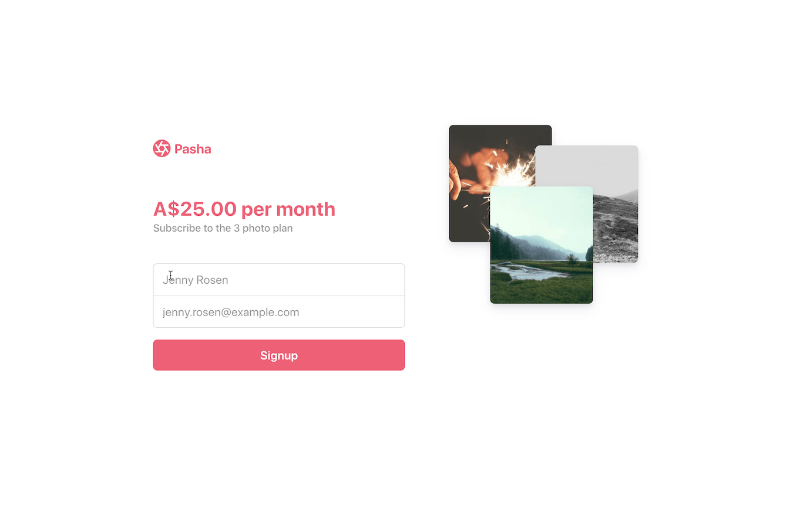

# Subscriptions with Card and Direct Debit payment methods

This sample shows how to create a customer, set up a card or direct debit payment method for recurring use, and subscribe them to a subscription plan with
[Stripe Billing](https://stripe.com/billing).

If you only want to accept card payments, see the [subscription-use-cases](https://github.com/stripe-samples/subscription-use-cases) sample instead.

The sample uses Stripe Elements, a web UI library of customizable form fields, to build the UI to collect payment method details.

You can see a [demo](https://ndqqb.sse.codesandbox.io/) running in test mode, and you can fork it on [codesandbox.io](https://codesandbox.io/s/github/stripe-samples/subscriptions-with-card-and-direct-debit/tree/codesandbox).


### Features:

- 💳Securely collect card details
- 🏦🇦🇺Collect AU bank account details and set up recurring mandates for direct debits (requires the plan to be in `AUD`)
- 🔒Save the payment method details to a customer
- 💰Subscribe the customer to a subscription plan

## How to run locally

This sample includes [5 server implementations](server/) in our most popular languages. Follow the steps below to run one of the servers locally.

**1. Clone and configure the sample**

The Stripe CLI is the fastest way to clone and configure a sample to run locally.

**Using the Stripe CLI**

If you haven't already installed the CLI, follow the [installation steps](https://github.com/stripe/stripe-cli#installation) in the project README. The CLI is useful for cloning samples and locally testing webhooks and Stripe integrations.

In your terminal shell, run the Stripe CLI command to clone the sample:

```
stripe samples create subscriptions-with-card-and-direct-debit
```

The CLI will walk you through picking your integration type, server and client languages, and configuring your `.env` config file with your Stripe API keys.

**Installing and cloning manually**

If you do not want to use the Stripe CLI, you can manually clone and configure the sample:

```
git clone https://github.com/stripe-samples/subscriptions-with-card-and-direct-debit
```

Copy the `.env.example` file into a file named `.env` in the folder of the server you want to use. For example:

```
cp .env.example server/node/.env
```

You will need a Stripe account in order to run the demo. Once you set up your account, go to the Stripe [developer dashboard](https://stripe.com/docs/development/quickstart#api-keys) to find your API keys.

```
STRIPE_PUBLISHABLE_KEY=<replace-with-your-publishable-key>
STRIPE_SECRET_KEY=<replace-with-your-secret-key>
```

`STATIC_DIR` tells the server where the client files are located and does not need to be modified unless you move the server files.

**2. Create Products and Plans on Stripe**

This sample requires a [Plan](https://stripe.com/docs/api/plans/object) ID to create the subscription. Products and Plans are objects on Stripe that you use to model a subscription.

You can create Products and Plans [in the Dashboard](https://dashboard.stripe.com/products) or with the [API](https://stripe.com/docs/api/plans/create). Create a Plan to run this sample and add it to your `.env`.

**3. Follow the server instructions on how to run:**

Pick the server language you want and follow the instructions in the server folder README on how to run.

```
cd server/node # there's a README in this folder with instructions
npm install
npm start
```

**4. [Optional] Run a webhook locally:**

You can use the Stripe CLI to forward webhook events to your server running locally.

If you haven't already, [install the CLI](https://stripe.com/docs/stripe-cli) and [link your Stripe account](https://stripe.com/docs/stripe-cli#link-account).

```
stripe listen --forward-to localhost:4242/webhook
```

The CLI will print a webhook secret key to the console. Set `STRIPE_WEBHOOK_SECRET` to this value in your .env file.

You should see events logged in the console where the CLI is running.

When you are ready to create a live webhook endpoint, follow our guide in the docs on [configuring a webhook endpoint in the dashboard](https://stripe.com/docs/webhooks/setup#configure-webhook-settings).

## FAQ

Q: Why did you pick these frameworks?

A: We chose the most minimal framework to convey the key Stripe calls and concepts you need to understand. These demos are meant as an educational tool that helps you roadmap how to integrate Stripe within your own system independent of the framework.

## Get support
If you found a bug or want to suggest a new [feature/use case/sample], please [file an issue](../../issues).

If you have questions, comments, or need help with code, we're here to help:
- on [Discord](https://stripe.com/go/developer-chat)
- on Twitter at [@StripeDev](https://twitter.com/StripeDev)
- on Stack Overflow at the [stripe-payments](https://stackoverflow.com/tags/stripe-payments/info) tag
- by [email](mailto:support+github@stripe.com)

Sign up to [stay updated with developer news](https://go.stripe.global/dev-digest).

## Author(s)

- [@ctrudeau-stripe](https://twitter.com/trudeaucj)
- [@thorsten-stripe](https://twitter.com/thorwebdev)
